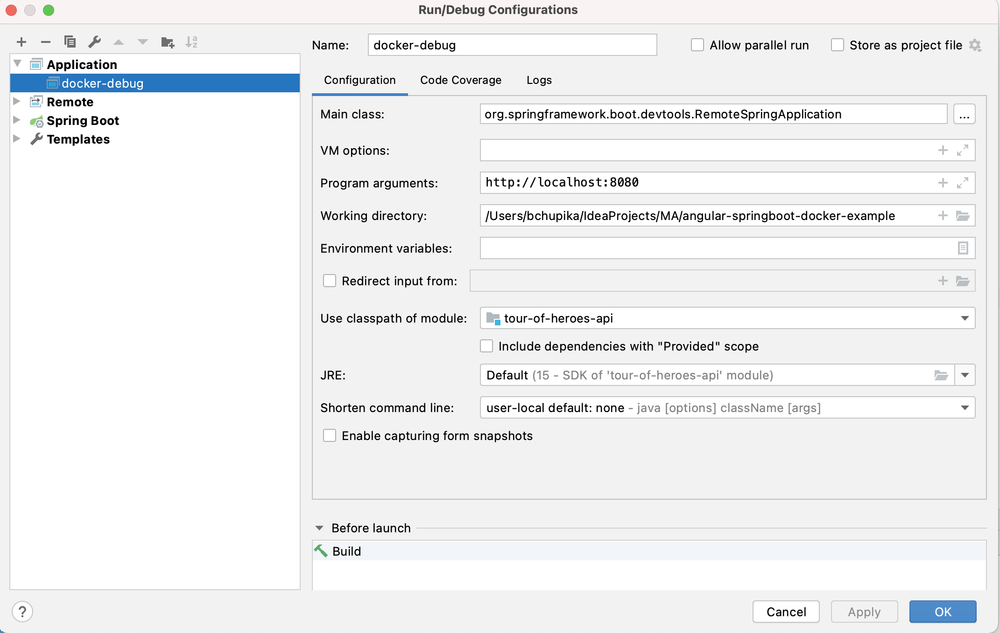

# redis-springboot-angular-docker-example

This project is an example of a popular technology stack based on Redis + Angular + SpringBoot + Docker.
This project can be useful if you have the test task required technologies listed above.

#### Strongly recommended:
Go through official Angular [tutorial](https://angular.io/tutorial) if you haven't done it yet

### For launch project
1. Install Docker Desktop and register on DockerHub

2. Run next command in terminal from `tour-of-heroes-api` directory:

    > mvn clean package

3. Run next command in terminal from the main directory:

    > docker-compose up --build

4. Open your browser on http://localhost:4200.

5. To verify redis is woring send the following HTTP GET requests:
    - insert data:
        > http://localhost:8080/redis/add?key=alice&value=1234
        > http://localhost:8080/redis/add?key=bob&value=3456
    - get data back
        > http://localhost:8080/redis?key=alice
        > http://localhost:8080/redis?key=bob

### For local development
1. Install redis: [doc](https://redis.io/topics/quickstart)

2. After installation run tests. The command will be printed in the console right after installation.

3. Run redis:
    > redis-server

4. Test redis is up
    > redis-cli ping

5. If everything is OK - run SpringBoot app and send get request:
    - insert data:
        > http://localhost:8080/redis/add?key=alice&value=1234
        > http://localhost:8080/redis/add?key=bob&value=3456
    - get data back
        > http://localhost:8080/redis?key=alice
        > http://localhost:8080/redis?key=bob

### For local debugging and live reload
You can run your java project in docker and debug using Intellij idea!
For this purpose we have the following line in docker-compose.yml `- JAVA_TOOL_OPTIONS=-agentlib:jdwp=transport=dt_socket,server=y,suspend=n,address=*:5005`.
Remote debugging works over websocket connections. 

Also, you are able to modify your code in IntellijIdea and this changes will be mirrored to jar file that is inside the docker image.

1. In order to use DevTools LiveReload you’ll need to set up a **Run Configuration** on your local machine. 
Go to **Run - Edit configurations**, press + and select **Application**. 
Setup it as shown on the picture below:

    Key points:
    - **Main class:** in the picture, under the Build and run section, the second field stands for “Main class”, which is the Main class of the application running under this configuration. It should be a RemoteSpringApplication.
    - **Program arguments:** third field, should be set to http://localhost:8080 as it is the domain our local application starts on.
    - Press OK.

1. Run app with following command (see detailed instruction at the start of the doc):
    > docker-compose up
1. From now every time when you want to see changes in action, you just Command+S (Ctrl+S in Windows) and after a few seconds you’ll see these messages in terminal:

1. Like with LiveReload, Docker debugging also requires a specific Debug Configuration. Go to Run - Edit configurations, press + and start typing remote. You should see a Remote JVM Debug, add it and setup as follows:

    Key points:
    - Debugger mode - Attach
    - Host - localhost, Port - as you wish as long as it’s available
    - Command line arguments - paste the next line -agentlib:jdwp=transport=dt_socket,server=y,suspend=n,address=*:<your_port>
    - Press OK.

